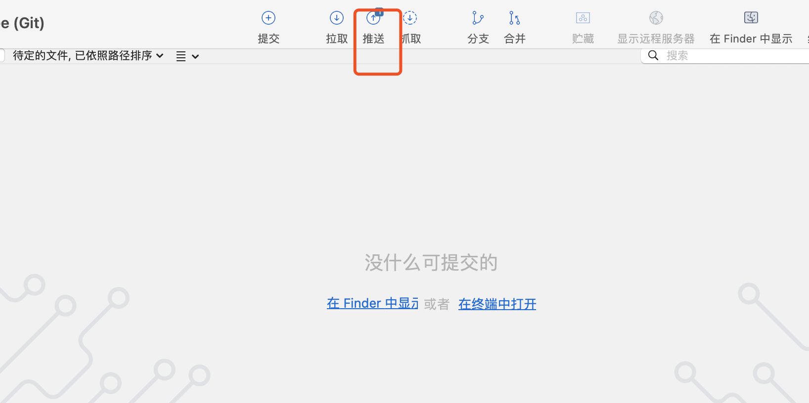

[toc]

# sourceTree的使用

## 安装

- https://www.sourcetreeapp.com/

### 简介

•免费Git图形界面工具，可以操作任何Git库

•可以直接添加本地git仓库，也可以选择“New”-“Clone from URL”直接从远程克隆到本地

•可以实时监控自己代码的修改状态，还可以可视化地查看每个代码版本之间的差异

## 服务端新建项目

- 远端新建一个仓库

  

## clone远程仓库

- 点击sourcetree新建，选择从URL克隆，填入工程地址


### 上传本地项目到远程服务器

- cd到拉取下来的本地仓库 

  

- 新建一个本地项目在sourcetree目录

  

  

- 打开sourcetree软件，点击提交

  


- 提交成功之后，点击推送

  


- 项目上传成功

### 关联仓库

- ```xml
  git remote add origin git@github.com:<github username>/<repository name>.git
  ```

- ```crmsh
  git pull origin master --allow-unrelated-histories
  ```


## **本地仓库的创建和提交**

- 桌面新建本地项目,创建file1文件

  

- 打开sourcetree点击新建创建本地仓库


- 第一次上传需要验证

  

- 查看标签 git remote -v 

- pull  git pull --rebase tree2 master   

- git push -u tree2 master 

### ssh生成

- 本地生成ssh文件

  - 客户端生成SSH key （公钥和私钥）

    - ```shell
      $ ssh-keygen -t rsa -C "your_email@example.com" -b 2048
      ```

  - 在服务端的配置文件中加入你的公钥  .pub文件

    - 查看公钥 $ cat ~/.ssh/id_rsa.pub

- 配置token

  

- 关联远程仓库

  - 服务器创建一个新的空仓库，复制仓库地址

  - 点击面板右上角设置

    

  - 填写远程仓库名字和地址

    
  
  - 第一次推送会输入账号密码
  
    

## 重置当前分支到某次提交

- 文件状态选择某次提交

  

- 点击强行合并

  

> 这个功能一般不推荐使用

## 查看历史

- 选择之前的某次提交，点击检出

  

- 会出现一个HEAD，创建了一个分支


## 修改历史并创建分支

- 当有未提交更改时不要创建分支

  

- 可以点击放弃文件

  

### 新建分支命名

- 选中分支，点击分支


- ==分支合并==

  - 分支1合并到master，先切换到master分支，选中分支1点击合并

    

  - 合并成功

    