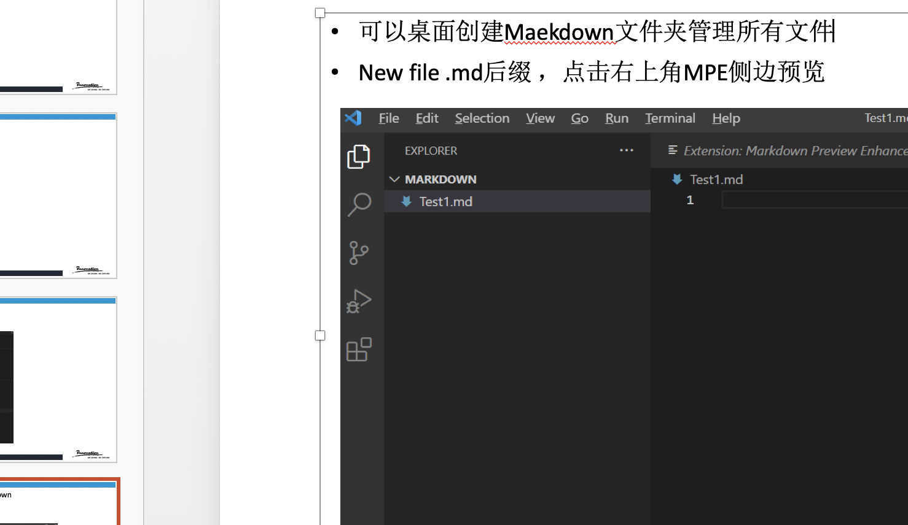
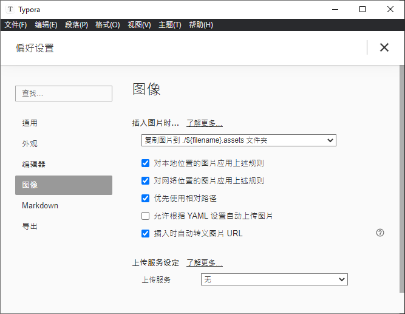

[TOC]

## 文本样式

*斜体* _斜体_  **粗体**	***加粗斜体***  ~~删除线~~ 

*aaa*

**aaa**

~~delete~~

---

==gaoliang==


## 超链接

### 文本链接

[baidu](https://www.baidu.com)


### 地址链接

<www.baidu.com>


## 列表

### 无序列表

+ ​

- ​

+ list
  - list1
  - ​

+ 二级列表
+ 三级列表

- 一级列表
  - 二级列表
    - 三级

### 有序列表

1. ​
2. list
   + list1
   + ​

### 任务列表 

- [ ] eat

- [x] heat


 - [x] [check this url](https://www.baidu.com)
 - [ ] run

## 引用

> quote
>
> > quote
> >
> > > quote
> > >
> > > 

## 插入图像




### 加载本地图片

​	

## 标注

Test1[^1]

[^1]: 解释test1


Demo[^2]

[^2]: demo2


## 表格

| table | table2 | table3 |      |      |      |
| :---- | ------ | ------ | ---- | ---- | ---- |
|       |        |        |      |      |      |
|       |        |        |      |      |      |
|       |        |        |      |      |      |


| sex  | age  | name | school |
| :--- | ---- | ---- | ------ |
|      |      |      |        |


| Table1 | table2 | table3 |
| -----: | ------ | -----: |
|      a | b      |      c |


| tab1 | tab2 | tab3 |
| ---- | ---- | ---- |
| a    | b    | c    |


| a      |    c |  ccvv | mid    |
| :----- | ---: | ----: | ------ |
| naddsa | bbbb | ccccc | midddd |


## 代码块

```java
class {
  
}
```


`python`


```python 
print('hello word')
```

~~~objective-c
print("hello world")
~~~

`print("hello")`

```python
    def func1():
      print(a+b)
```
~~~objective-c
  nslog("aaaaa")
~~~

## 上标和下标

h~2~o

x^2^

h~2~o

x^2^


## 公式

$$sum_{i=1}^n a_i=0$$


$$sum$$


## 数据结构

### 链表


